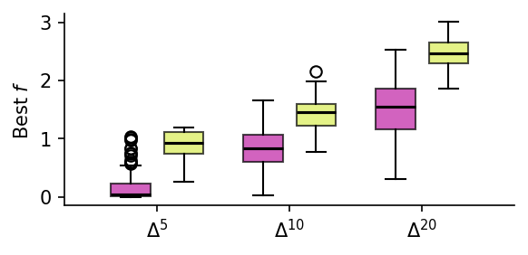

# Reaching the Boundary — Project Page

Academic project page for the paper:

> **Reaching the Boundary: Astral Spaces for Riemannian Optimization over the Probability Simplex**  
> Federico Pavesi, Noémie Jaquier, Antonio Candelieri  
> UAI 2026 · [arXiv:2603.09793](https://arxiv.org/abs/2603.09793)

---

## Setup: deploy to GitHub Pages in 3 steps

### 1. Upload files

Drop these two files into your repository root:

```
your-repo/
├── index.html       ← the project page
└── _config.yml      ← tells GitHub Pages to serve raw HTML
```

### 2. Add your figures

Place your result images in the repo root alongside `index.html`:

```
your-repo/
├── index.html
├── _config.yml
├── all_dimensions.png
├── Ackley_all_dims.png
└── Rosenbrock_all_dims.png
```

Then in `index.html`, replace the placeholder `<p>` tags inside each `.figure-area`
with a plain `` tag, for example:

```html
<!-- Before -->
<p style="color:var(--text-faint); font-size:0.85rem;">
  Place all_dimensions.png here.
</p>

<!-- After -->

```

### 3. Enable GitHub Pages

In your repository: **Settings → Pages → Source → Deploy from branch → main / root**.

Your site will be live at `https://your-username.github.io/your-repo/`.

---

## Why this works (and why math renders)

Math is rendered by [MathJax 3](https://www.mathjax.org/) loaded directly in `index.html`
via a `<script>` tag. This is completely independent of GitHub's Markdown renderer,
so every `$...$` and `$$...$$` in the HTML renders perfectly — including inside
table cells, theorem blocks, and algorithm steps.

No Jekyll theme, no plugins, no build step needed. `_config.yml` just tells
GitHub Pages not to apply any default theme.

---

## Customisation

- **Logo**: add `` to the header section.
- **QR code**: add an `` tag in the contact section.
- **Colour scheme**: edit the CSS variables at the top of `index.html` under `:root`.
- **Venue badge**: change the `<p class="venue">` line in the header.


